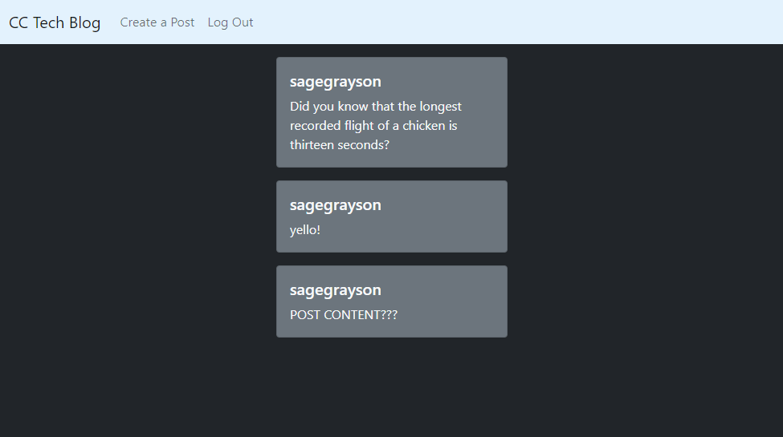

<!-- TODO:
check route imports (models mainly)
clarify route exports (use?)
withauth?
clarify handlebar names
 -->

# Tech Blog 

## Description

This is a working demo blog with the ability to create an account, log in, and post messages.

## Contents

-   [Installation](#installation)
-   [Usage](#usage)
-   [License](#license)
-   [Contact](#contact)

## Installation

Clone the repo and run "npm i". If hosting locally, you may have to use the ENV file to connect to a SQL database.

## Usage

To use the deployed version, create an account or log in, and then you'll be able to post messages.

## License

The project uses the [Creative Commons](https://creativecommons.org/licenses/) license.

## Contact

Link to my github: [sagegrayson](https://github.com/sagegrayson)

If you'd like to contact me, email me at [skaseyg@gmail.com](mailto:skaseyg@gmail.com)
